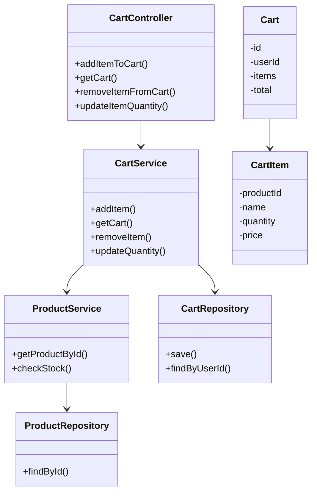
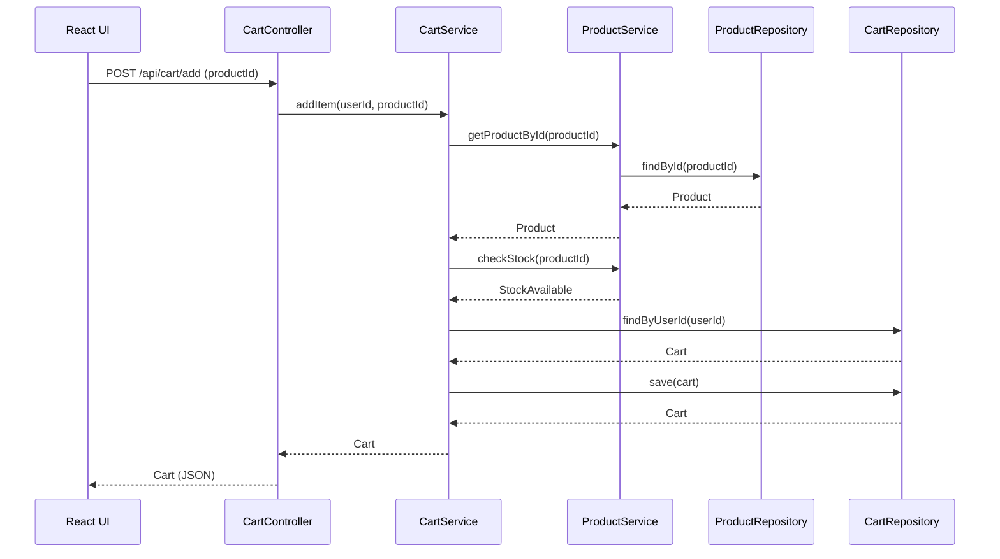
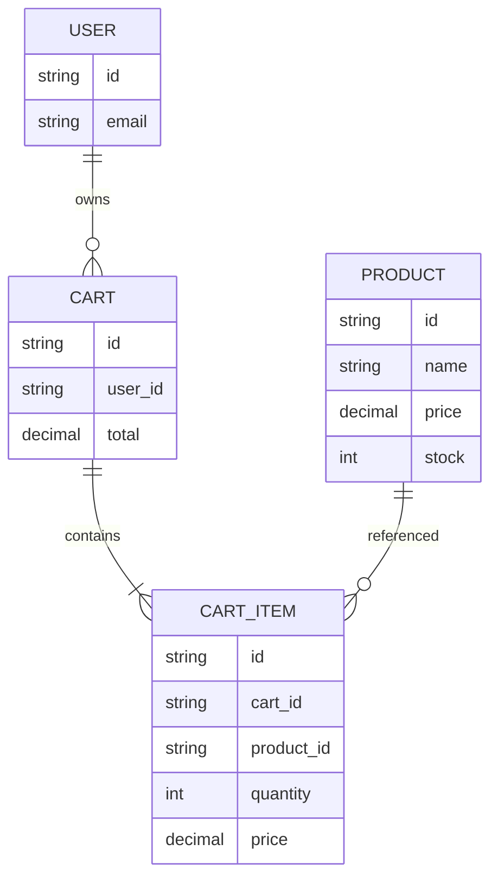

# Low-Level Design Document: Add Items to Shopping Cart (SCIB_SCRUM-11692)

## 1. Objective
This document details the technical design for enabling customers to add items to their shopping cart in an e-commerce application. The solution ensures correct quantity and pricing, real-time updates, and persistence across navigation and refresh. The backend is implemented with Spring Boot, and the frontend with React.

## 2. Backend Spring Boot API Details

### 2.1. API Model
#### 2.1.1. Common Components/Services
- CartService: Business logic for cart operations
- ProductService: Product lookup and stock validation
- CartRepository: Persistence for cart data
- ProductRepository: Product data access
- CartController: REST endpoints for cart actions
- SessionService: User/session management

#### 2.1.2. API Details
| Operation                | REST Method | Type     | URL              | Request JSON                                                                 | Response JSON                                                                 |
|-------------------------|-------------|----------|------------------|------------------------------------------------------------------------------|-------------------------------------------------------------------------------|
| Add item to cart        | POST        | Command  | /api/cart/add    | { "productId": "string", "quantity": int (optional, default 1) }          | { "cartId": "string", "items": [ { "productId": "string", "name": "string", "quantity": int, "price": decimal } ], "total": decimal } |
| Get cart                | GET         | Query    | /api/cart        | -                                                                            | { "cartId": "string", "items": [ { "productId": "string", "name": "string", "quantity": int, "price": decimal } ], "total": decimal } |
| Remove item from cart   | DELETE      | Command  | /api/cart/item   | { "productId": "string" }                                                   | { "cartId": "string", "items": [...], "total": decimal }                 |
| Update item quantity    | PUT         | Command  | /api/cart/item   | { "productId": "string", "quantity": int }                                 | { "cartId": "string", "items": [...], "total": decimal }                 |

#### 2.1.3. Exceptions
- ProductNotFoundException
- OutOfStockException
- CartNotFoundException
- InvalidQuantityException
- UnauthorizedAccessException

### 2.2. Functional Design
#### 2.2.1. Class Diagram

#### 2.2.2. UML Sequence Diagram

#### 2.2.3. Components
| Component Name   | Description                                         | Existing/New |
|------------------|-----------------------------------------------------|--------------|
| CartController   | REST endpoints for cart operations                  | New          |
| CartService      | Business logic for cart                             | New          |
| ProductService   | Product lookup and stock validation                 | Existing     |
| CartRepository   | Cart data persistence                               | New          |
| ProductRepository| Product data access                                 | Existing     |
| Cart             | Cart domain model                                   | New          |
| CartItem         | Cart item domain model                              | New          |
| SessionService   | User/session management                             | Existing     |

### 2.3. Service Layer Business Logic
- **Architecture:**
  - CartService is injected into CartController.
  - ProductService and CartRepository are injected into CartService.
- **Workflow:**
  1. User requests to add item to cart.
  2. CartService validates product existence and stock.
  3. If valid, adds or updates item in cart.
  4. Recalculates total.
  5. Persists cart.
- **Caching:**
  - Product data may be cached for performance (e.g., using Spring Cache).
  - Cart data is session-based, optionally cached in Redis for scalability.
- **Validation Rules:**
| Field Name   | Validation                                 | Error Message                        | Class Used        |
|--------------|--------------------------------------------|--------------------------------------|-------------------|
| productId    | Must exist in ProductRepository            | Product not found                    | ProductService    |
| productId    | Must have stock > 0                        | Product out of stock                 | ProductService    |
| quantity     | Must be > 0                                | Invalid quantity                     | CartService       |
| userId       | Must be authenticated                      | Unauthorized access                  | SessionService    |

### 2.4. Service Integrations
| System      | Integrated For         | Integration Type |
|-------------|-----------------------|------------------|
| Product DB  | Product lookup/stock  | JPA/Repository   |
| Session     | User session          | Spring Security  |
| Cache (opt) | Cart/session caching  | Redis (optional) |

## 3. Front End React Details

### 3.1. UI Component Architecture
- **Component Hierarchy:**
  - `App`
    - `ProductList`
      - `ProductCard`
        - `AddToCartButton`
    - `Cart`
      - `CartItem`
- **Data Flow:**
  - ProductList fetches products.
  - AddToCartButton triggers API call to add item.
  - Cart fetches and displays cart items.
- **State Management:**
  - Use React Context or Redux for cart state.
  - Cart state persists in localStorage/sessionStorage for guest users.
- **Props Interfaces:**
  - ProductCard: { product: Product }
  - AddToCartButton: { productId: string }
  - Cart: { items: CartItem[], total: number }
- **Routing Structure:**
  - `/products` - Product listing
  - `/cart` - Shopping cart

### 3.2. UI Specifications
- **Wireframes:**
  - ProductList: Grid of ProductCards with AddToCartButton
  - Cart: List of CartItems, total price, update/remove buttons
- **Responsive Design:**
  - Breakpoints: 320px, 768px, 1024px
- **Form Structures/Validation:**
  - AddToCartButton disables if out of stock
  - Quantity input (if present) validates >0
- **User Interaction Patterns:**
  - Optimistic UI update on add
  - Toast/alert for errors (e.g., out of stock)

### 3.3. API Integration
- **HTTP Client:**
  - Use Axios or Fetch API
  - Base URL from environment config
- **API Call Patterns:**
  - POST `/api/cart/add` on AddToCart
  - GET `/api/cart` to fetch cart
- **Error Handling:**
  - Show error messages for API failures
- **Loading States:**
  - Show spinner/loading for API calls
- **Data Transformation:**
  - Map API response to Cart state shape

## 4. Database Details

### 4.1. ER Model

### 4.2. Database Validations
- Product existence and stock checked before insert/update
- Cart item quantity must be >0
- Cart total recalculated on every change

## 5. Non-Functional Requirements
### 5.1. Performance
- Support 10,000 concurrent users
- Add to cart ≤ 500ms
### 5.2. Security
- Use HTTPS for all API calls
- Authenticate users via Spring Security (JWT/session)
- Authorize cart access by user/session
### 5.3. Logging
- Application logs for all cart actions
- Audit logs for add/remove/update
- Monitoring via Prometheus/Grafana (optional)

## 6. Dependencies
- Spring Boot 3.x
- Spring Data JPA
- Spring Security
- Redis (optional)
- React 18+
- Axios/Fetch
- Mermaid.js (for diagrams)

## 7. Assumptions
- Product and user management already exist
- Cart is per user (authenticated) or per session (guest)
- Product prices do not change during cart session
- Cart is not shared between users

---

**Filename:** `LLD_SCIB_SCRUM-11692.md` (in folder: LLD)
